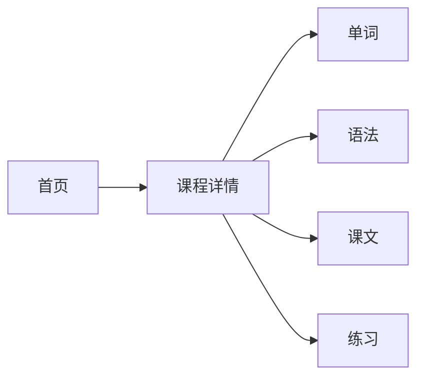

# JapaFlow Next 学员端改造

## 这次要做什么

把用户真正会看到、会使用的整个学习入口改成 Next.js：



不是只换首页。用户从首页进入一课后，单词、语法、课文、练习也都由 Next 页面展示。

当前这些内容分别在 `app.js`、`tools/*.html` 和 `practice/react/*` 里。新的学员端将它们收拢成一套页面和组件；旧 `tools` 只保留给管理员检查 OCR、调整音频时间和人工核验。

## 用户最后会看到什么

1. 首页：初级、中级；上册、下册；已开放课程能进入，未准备好的课程显示建设中。
2. 课程详情：`标日初级第 1 课`、课程编号切换、单词/语法/课文/练习四个 Tab。
3. 单词：日文、假名、中文释义、播放本词对应音频。
4. 语法：教材图片和本课语法内容。
5. 课文：日文、kana/ruby、翻译、逐句音频。
6. 练习：沿用现有题目、判题、提交记录和登录态；只是从独立静态页迁到 Next 内。

## 什么继续保留

| 保留内容 | 用途 |
| --- | --- |
| `data/catalog.json`、`course-availability.json`、`intermediate-catalog.json` | 首页课程目录与开放状态 |
| `data/ocr/*-audio-verified.json` | 单词和课文的人工确认音频标记 |
| `course-assets/`、OSS 音频 | 教材图片与音频 |
| `/api/japaflow/*` 和 Java API | 用户练习记录、提交与进度 |
| `server.mjs` 的 AI、音频、OCR 接口 | 迁移为 Next Route Handlers，保留现有能力 |
| `tools/*` | 暂存为 Next `public` 下的管理员工具，后续再改 React |

## 服务怎么分工

```text
Next 服务：
  /                    首页
  /courses/*           课程详情、单词、语法、课文、练习
  /api/*               音频、AI、OCR、练习记录等接口
  /admin-tools/*       暂存的管理员调试与人工校准工具

外部服务：
  Java API             用户练习记录、提交与进度
  Azure、DeepSeek      发音、转写与判题
  OSS/CDN              音频与教材资源

静态资源：
  课程 JSON、图片      Next public 或 OSS/CDN
  音频                 OSS/CDN
```

目标状态没有单独运行的旧 `server.mjs`。Next 本身也是 Node.js 应用，但它是唯一的 Web 服务：页面由 App Router 渲染，原来写在 `server.mjs` 的接口逐步改为 `app/api/**/route.ts`。

现有 `/practice/*` 会在练习迁入 Next 后退出学员路径。现有 `tools` 页面可先放进 Next 的 `public/admin-tools`，以静态文件方式继续给管理员使用；它们不再依赖旧 Node 服务。

## 新页面的组织方式

```text
app/
  page.tsx                         首页
  courses/[lessonId]/page.tsx      课程详情
components/
  course/CourseCatalog.tsx         课程目录
  course/CourseUnit.tsx            单元与课程行
  course/CourseTabs.tsx            单词/语法/课文/练习切换
  vocabulary/VocabularyStudy.tsx   单词学习
  grammar/GrammarStudy.tsx         语法图片与内容
  text/TextStudy.tsx               课文、ruby 和逐句音频
  practice/PracticeStudy.tsx       现有 React 练习组件
lib/
  course/                          课程目录、开放规则、类型
  content/                         OCR JSON、图片、音频读取与转换
```

课程和当前 Tab 直接写在 URL 中，例如 `/courses/7?part=text`。刷新、复制链接或前进后退，都能回到同一课、同一个模块；不需要额外的全局状态库。

## 改造顺序

1. 建立 Next.js + TypeScript 项目，先接入现有课程目录和开放规则。
2. 做首页和课程详情页，让课程可以从首页进入。
3. 迁移单词：优先读取 verified 音频数据，支持播放和假名展示。
4. 迁移语法和课文：保留教材图片、ruby、翻译与逐句播放。
5. 把已有 React 练习组件放进 Next，继续调用原来的练习接口。
6. 旧 tools 保留为管理工具；学员端不再进入 tools。

## 这次不碰的部分

- OCR 解析、重新生成课程内容、音频自动切分。
- 音频时间轴编辑、approved/pending/risk 人工校准页面。
- AI 判题、转写和发音评测的业务规则改造；本次只迁移现有 API 调用方式到 Next Route Handlers。
- 登录、注册和 Java 后端本身。
- 中级课程的实际教材内容生产。

## 需要提前决定的事

1. **浏览器是否只访问 Next 的同域地址？推荐：是。** Next 在服务端调用 Java API 与 AI 服务，浏览器不直接面对多个后端地址。
2. **首版是否保留课程编号切换？推荐：保留。** 对你自己跳课验证很方便。
3. **首页是否马上显示学习进度？推荐：先不做。** 先把完整学习路径稳定下来，进度随后接 Java API。
4. **iOS 是否同时改造？推荐：Web 先完成。** Next 学员端稳定后，再单独处理 Capacitor 打包。

## 完成后的关键变化

- 用户不再从首页跳入 `tools` 页面。
- 学员端只有一套 Next 页面，不再混合 Vanilla HTML、iframe 和独立 React 页。
- 管理员工具仍保留，但由 Next 静态资源与 Route Handlers 承接，不再保留旧 Node Web 服务。
- 这会成为面试中可以真实讲清楚的项目取舍：保留复杂后台能力，优先统一用户侧体验。
